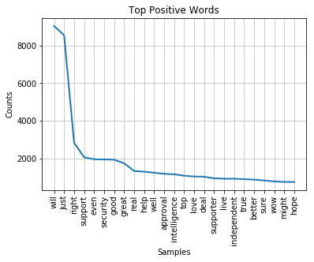
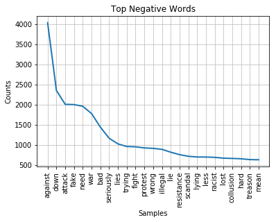

# Complex Sentiment Analysis

#### Opening data files

Instead of getting the data from the web in the script, I suggest you just download it and save it in the folder your script is in. Here are the links:

Positive data http://www.unc.edu/~ncaren/haphazard/positive.txt

Negative data http://www.unc.edu/~ncaren/haphazard/negative.txt


##### Now we load the negative words


```python
import pandas as pd

negText = pd.read_csv("negative.csv")
negTokens = negText['Neg'].tolist()
print(negTokens[-10:])
```

    ['wretched', 'wretchedly', 'wretchedness', 'wrong', 'wrongful', 'wrought', 'yawn', 'zealot', 'zealous', 'zealously']


###### Now we load the positive words


```python
posText = pd.read_csv("positive.csv")
posTokens = posText['Pos'].tolist() # This splits the text file into tokens on the new line character
#posTokens[-1:] = [] # This strips out the final empty item
print(posTokens[-10:])
```

    ['worthwhile', 'worthy', 'wow', 'wry', 'yearning', 'yearningly', 'youthful', 'zeal', 'zenith', 'zest']


###### Here we get the tweets


```python
tweetsText = pd.read_csv("trump100days.csv")
tweetsTokens = tweetsText['text'].tolist()
print(tweetsTokens[:6])
```

    ['RT @jmichaelkell: To sum it up:\r\r1. Trump - sexual predator\r2. Epstein - convicted pedophile\r3. Milo - pedophilia supporter\r4. Huckabee - pÄ', "RT @DrDavidDuke: Did John McCain wiretap President Trump's government phone and leak classified information to the press? https://t.co/NsSVÄ", "RT @PrisonPlanet: The Revolutionary Communist Party's @SunsaraTaylor says Trump will enact global genocide.\r\rLike communism, which killed 9Ä", '"Team Trump shares tips on keeping their boss distracted, placated" https://t.co/8UUV4TsQLa sure signs of NPD.  Sad state of affairs.', 'RT @larryelder: Rep. @MaxineWaters says Trump\'s cabinet picks are "bunch of scumbags." Is that better or worse than a "basket of deplorableÄ', "@CNNPolitics that's why Trump hired him stupid!"]


## Tokenizing the tweets

Now we will create two functions. The first for tokenizing a tweet, the second for calculating positive/negative words.


```python
import re
def tokenizer(theText):
    theTokens = re.findall(r'\b\w[\w-]*\b', theText.lower())
    return theTokens

def calculator(theTweet):
    # Count positive words
    numPosWords = 0
    theTweetTokens = tokenizer(theTweet)
    for word in theTweetTokens:
        if word in posTokens:
            numPosWords += 1
            
    # Count negative words
    numNegWords = 0
    for word in theTweetTokens:
        if word in negTokens:
            numNegWords += 1
    
    sum = (numPosWords - numNegWords)
    return sum

# Here is a line for testing this
# print(calculator('"RT @jmichaelkell: To sum it up:', '', '1. Trump - sexual predator', '2. Epstein - convicted pedophile', '3. Milo - pedophilia supporter', '4. Huckabee - pƒ"'))
```

## Analyzing tweets

Now we will use the calculator to calculate how many positive and negative tweets.
Note: that you can set a threshold for the number of words for a Tweet to be considered positive or negative.


```python
# Here we set up the thresholds
posi = 1 # This means there have to be more than 1 positive word
nega = 0 # This means there has to be more than 1 negative words

# Here we prime our variables
numTweets = 0
numPosTweets = 0
numNegTweets = 0
numNeutTweets = 0

# This loop goes through all the Tweets and calculates if sums the number of positive or negative ones.
for tweet in tweetsTokens:
    calc = calculator(tweet)
    if calc > posi:
        numPosTweets += 1
        numTweets += 1
    elif calc < nega:
        numNegTweets += 1
        numTweets += 1
    else:
        numNeutTweets += 1
        numTweets += 1

# This prints out the results        
print("Total: " + str(numTweets) + "\n" + "Positive: " + str(numPosTweets) + "\n" + "Neutral: " + str(numNeutTweets) + "\n" + "Negative: " +str(numNegTweets))
```

    Total: 181803
    Positive: 12182
    Neutral: 119985
    Negative: 49636


#### Gathering positive tweets

This will gather all examples of positive tweets.


```python
# Here we set up the threshold.
posi = 1 # This means there have to be more than 1 positive word
numberWanted = 4 # Here you decide how many tweets you want

# Here we prime our variables
numTweets = 0
numPosTweets = 0
posiTweetList = []

# This loop goes through all the Tweets and calculates if sums the number of positive or negative ones.
for tweet in tweetsTokens:
    calc = calculator(tweet)
    if calc > posi and numPosTweets < numberWanted:
        numPosTweets += 1
        posiTweetList.append(tweet)

print(posiTweetList)
```

    ['RT @JoyAnnReid: And again, Trump supporters likely will never hear about this from their preferred media outlets, though many will discoverÄ', '@LibyaLiberty I would have loved the center to praise trump too BUT he did NOT  GIVE them reason to praise him.', "RT @Brasilmagic: To keep Donald happy, Trump's staff has to ensure he's always receiving praise and adulation - feed the narcisissm. https:Ä", 'RT @ThomasWictor: Just watch: Terrorists will begin carrying out mass-casualty attacks in Europe, and Europeans will blame Trump while notÄ']


#### Gathering negative tweets

This will gather examples of negative tweets.


```python
# Here we set up the threshold.
nega = -1 # This means there have to be more than 1 positive word
numberWanted = 4 # Here you decide how many tweets you want

# Here we prime our variables
numTweets = 0
numNegTweets = 0
negaTweetList = []

# This loop goes through all the Tweets and calculates if sums the number of positive or negative ones.
for tweet in tweetsTokens:
    calc = calculator(tweet)
    if calc < nega and numNegTweets < numberWanted:
        numNegTweets += 1
        negaTweetList.append(tweet)

print(negaTweetList)
```

    ['RT @jmichaelkell: To sum it up:\r\r1. Trump - sexual predator\r2. Epstein - convicted pedophile\r3. Milo - pedophilia supporter\r4. Huckabee - pÄ', 'RT @alfonslopeztena: Dumped by Trump, jilted Europe and rejected Asia get together on trade deals threatening to leave US out in the cold\rhÄ', 'RT @snukasuper: #CNNLeaks Don Leming &amp; his band of @POTUS Trump haters on @CNN need to be exposed to the entire world https://t.co/EhH5iSdMÄ', "RT @ConstanceQueen8: 30 to 40% Released \rFrom GITMO \rReturn 2 Terror\rWhere's The Outrage \rTrump Inherits A Mess\rOf Obama's Decisions\r#WarriÄ"]


#### Testing a tweet

Here you can take a tweet and test it to see how many positive or negative words it has.


```python
tweetToCalc = input("What is the tweet to calculate? ")
print(calculator(tweetToCalc))
```

    What is the tweet to calculate? RT @jmichaelkell: To sum it up:  1. Trump - sexual predator 2. Epstein - convicted pedophile 3. Milo - pedophilia supporter 4. Huckabee - pƒ
    -2


#### Gathering and plotting positive and negative words

This will gather the words that are positive in the tweets and tabulate them.


```python
import re
posWordsList = []
negWordsList = []

def tokenizer(theText):
    theTokens = re.findall(r'\b\w[\w-]*\b', theText.lower())
    return theTokens

def wordsCalculator(theTweet):
    # Count positive words
    numPosWords = 0
    theTweetTokens = tokenizer(theTweet)
    for word in theTweetTokens:
        if word in posTokens:
            numPosWords += 1
            posWordsList.append(word)
            
    # Count negative words
    numNegWords = 0
    for word in theTweetTokens:
        if word in negTokens:
            numNegWords += 1
            negWordsList.append(word)

tweet2Process = input("What tweet do you want to process? ")
wordsCalculator(tweet2Process)
print("Positive words: " + str(posWordsList[:10]))
print("Negative words: " + str(negWordsList[:10]))
```

    What tweet do you want to process? RT @jmichaelkell: To sum it up:  1. Trump - sexual predator 2. Epstein - convicted pedophile 3. Milo - pedophilia supporter 4. Huckabee - pƒ
    Positive words: ['supporter']
    Negative words: ['predator', 'pedophile', 'pedophilia']


## Gathering and plotting all positive and negative words


```python
import re

# Here we set up the thresholds
posi = 1 # This means there have to be more than 1 positive word
nega = 0 # This means there has to be more than 1 negative words

# Here we prime our variables
posWordsList = []
negWordsList = []
numTweets = 0
numPosTweets = 0
numNegTweets = 0
numNeutTweets = 0

def wordsGathering(theTweet):
    # Count positive words
    numPosWords = 0
    theTweetTokens = tokenizer(theTweet)
    for word in theTweetTokens:
        if word in posTokens:
            numPosWords += 1
            posWordsList.append(word)
            
    # Count negative words
    numNegWords = 0
    for word in theTweetTokens:
        if word in negTokens:
            numNegWords += 1
            negWordsList.append(word)       
    
    sum = (numPosWords - numNegWords)
    return sum

# This loop goes through all the Tweets and calculates if sums the number of positive or negative ones.
for tweet in tweetsTokens:
    calc = wordsGathering(tweet)
    if calc > posi:
        numPosTweets += 1
        numTweets += 1
    elif calc < nega:
        numNegTweets += 1
        numTweets += 1
    else:
        numNeutTweets += 1
        numTweets += 1

print("Positive words: " + str(len(posWordsList)))
print("Negative words: " + str(len(negWordsList)))
```

    Positive words: 95204
    Negative words: 99592


###### Positive words


```python
import nltk, matplotlib

posDist = nltk.FreqDist(posWordsList)
posDist.tabulate(10)

%matplotlib inline
posDist.plot(25, title="Top Positive Words")


```

        will     just    right  support     good     even security    great     real     help 
        9046     8555     2818     2055     1962     1950     1937     1745     1326     1287 





###### Negative words


```python
import nltk, matplotlib

negDist = nltk.FreqDist(negWordsList)
negDist.tabulate(10)

%matplotlib inline
negDist.plot(25, title="Top Negative Words")
```

      against      down      fake    attack      need       war       bad seriously      lies    trying 
         4039      2351      2105      2003      1958      1777      1450      1162       996       958 





```python

```
