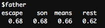

***
## Co-Occurrence of Words in the Shakespeare Drama Corpus

The following co-occurrence script aims to discover the semantic proximity of two words throughout the Shakespeare Drama Corpus. At the end, it will take in a word of the user's choice and find the top ten closest terms by proximity. 

***
#### Global parameters 

You will need to have set up a [Karst account](https://kb.iu.edu/d/bezu#account) first. Once you have your Karst account simply go to [rstudio.iu.edu](https://rstudio.iu.edu/auth-sign-in) and login using your IU username and passphrase.  Next, set the working directory by pointing to the location on Karst where you have stored the files. Below, we have chosen to save the folder "Text-Analysis" as a "Project" in R Studio on the Karst super-computer here at Indiana University. It contains the R scripts, texts, notebooks, and results. If you have forked and cloned the Github repository (see [textPrep.Rmd](textPrep.Rmd) for directions on how), simply point to where you have saved the folder. If you save it to your personal Karst folder, it will most likely look very similar to the example below. Karst is a unix server and so the home directory is represented by a ~ and, thus, the path will look like this "~/Text-Analysis/" (with the quotes). Alternatively, if you are on a PC, you will need to use an absolute path such as "C:/Users/XXX" (with the quotes again).

In R Studio, click Session in the menu bar > Set Working Directory > Choose Directory, then select the Text-Analysis directory in which you are working. This will set your working directory in the console pane, but make sure to copy the path into the source pane above to keep the directory constant if you close this script and reopen later. Make sure you click on the blue cube with a "R" in the center to set your working directory to your Text-Analysis project path.

HINT: Your working directory is the folder from which you will be pulling your texts.
```{r}
setwd("~/Text-Analysis/")
```
***
#### Include necessary packages for notebook 

R's extensibility comes in large part from packages. Packages are groups of functions, data, and algorithms that allow users to easily carry out processes without recreating the wheel. Some packages are included in the basic installation of R, others created by R users are available for download. Make sure to have the following packages installed before beginning so that they can be accessed while running the scripts.

In R Studio, packages can be installed by navigating to Tools in the menu bar > Install Packages. Or in the bottom right panel click on the "packages" tab and then click on "install."

The first three packages are used to render the RNotebook you are currently viewing:

knitr - Creates a formatted report from the script provided

markdown - a package used to render textual documents from plain text to others such as R and XML

rmarkdown - similar to markdown but specifically to render R documents


The next packages are used within the co-occurrence script:

NLP - Natural language processing package. Provides basic classes and methods for Natural Language Processing.

tm - this package provides tools (functions) for performing various types of text mining. In this script, we will use tm to performing text cleaning in order to have uniform data for analysis. Check out [this link](https://cran.r-project.org/web/packages/tm/vignettes/tm.pdf) for the documentation!

```{r}
library(knitr)
library(markdown)
library(rmarkdown)
library(NLP)
library(tm)
```

***
#### Create a corpus 

```{r}
corpus <- Corpus(DirSource("data/shakespeareFolger/"))
```

***
#### Clean the corpus


To clean the corpus in this example, we are using the tm package's built in tools to:
1) lowercase all words, 
2) remove stopwords ("a" "an" "the"), 
3) remove any other words the tm package might not consider a stopword by using the earlyModernStopword.txt file found in the data folder.
4) remove punctuation
5) strip out any whitespace between words
6) return corpus to Plain Text

```{r}
corpus <- tm_map(corpus, content_transformer(tolower))
myStopWords <- scan("data/earlyModernStopword.txt", what="character", sep="\n")
corpus <- tm_map(corpus, removeWords, c(stopwords("english"), myStopWords))
corpus <- tm_map(corpus, removePunctuation)
corpus <- tm_map(corpus, stripWhitespace)
corpus <- tm_map(corpus, PlainTextDocument)
```

***
#### Processing

After the corpus has been cleaned, we can now begin to process the text. The next step uses the DocumentTermMatrix() function again from the tm package. This function creates a matrix where each document is a row and the terms in the text make up the columns, saved here as "dtm." The rest of the matrix consists of the frequencies for each term within each document. 

```{r}
dtm <- DocumentTermMatrix(corpus)
```
After we create the DocumentTermMatrix we need to remove sparse terms, another function from the tm package. This helps eliminate sparse terms that appeare to co-occure when in reality they do not. An example being the word "squirrel" appears to co-occure with the word "love" in Shakespeare's plays at a .69 rate. Well, Shakespeare only uses the word "squirrel" three times, and "love" appears near "squirrel" in two of the three plays (thus the 69% rate). Basically, by removing sparse terms we eliminate these false co-occurences. The 0.5 eliminates terms that appear 0 times in 50% of the documents. So the higher your percentage, the fewer terms are removed. If you choose 0.8, you are removing terms that appear 0 times in 80% of the documents, which means the term only needs to appear 1 time in 20% of the documents to remain in the dtms.   

```{r}
dtms <- removeSparseTerms(dtm, 0.5)
```

Once we've created the Document-Term Matrix and removed sparse terms, we need to find the overall frequency of each term across the corpus. Here, we get the sums of the columns (colSums) within the Document-Term Matrix and save it as a sorted numeric vector called "freq."

```{r}
freq <- sort(colSums(as.matrix(dtms)), decreasing = TRUE)
```

***
### Results

Finally, we use the tm function findAssocs to find the top ten associations with any word we choose. NOTE: for this to work, you must first click the "Source" button in the source box and then run the findAssocs script in the Console on the bottom left in RStudio. It must be done in that order. It is recommended that you just comment out the findAssocs function in the Source box and copy and paste it into the Console box just below it. If you try to run the findAssocs script in the Source box on the top left, you will see no results. The example below is the word "father" but you can choose any word as you are learning, or can even have multiple lines returning multiple associations (uncomment the line below the "father" association line)

```{r}
findAssocs(dtms, "father", .6)
#findAssocs(dtms, "love", .6)
```



***
### Voila!
