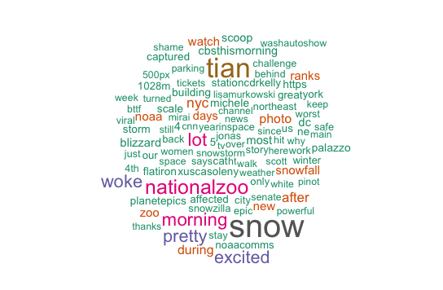

## Wordcloud of Top 100 Words in tweets using the hashtag #blizzard2016
***
Using 3200 tweets with the hashtag #blizzard2016 from January 24, 2016, we will create a wordcloud of the top words used to describe Winter Storm Jonas.

***

### Global parameters 
***
Set working directory by pointing to the location on your computer where you have stored the files. Below, we have chosen to Save the folder "RAnalysis" on the Desktop on a Mac. It contains all the other R scripts, texts, notebooks, and results. If you have branched the github, simply note where you have save the folder. If you are on a PC, you will need to use an absolute path such as "C:Users:XXX."
***
```{r}
setwd("~/Desktop/R/Text_Analysis/data/twitter/")
```

***
Include necessary packages for notebook
***
```{r}
library(knitr)
library(markdown)
library(rmarkdown)
library(wordcloud)
library(qdap)
library(RColorBrewer)
```

***
Load data (this time a curated set of tweets grabbed using the twitterR library and API authentication, then saved with the .RData extension)
***
```{r}
load(file = "blizzard2016v2.RData")
```

***   
####Prepare text data
While it seems logical to use tm again to create our wordcloud, there is a bug in the library that causes it to fail with this kind of data when run on a mac. Instead, we will take the opportunity to process the data in a different way.

First we are going to take the list of 320 tweets created when we grabbed the file above and convert it into a character vector, grabbing only the text. The "sapply" function to traverse the list "tweets" applying a function "x" which grabs the text. 
***
```{r}
tweetlist <- sapply(tweets, function(x) x$text)
```

***
Next we want to strip the URLs from our tweets. Using "gsub" to replace URLS in our list with any of the characters below with nothing (""), our tweetlist is now free of them. Notice that the "|" is used to created a concatenated "http..." or "https..." with wild cards (*) for text after the hypertext transfer protocol.
***
```{r}
tweetlist=gsub("(f|ht)(tp)(s?)(://)(.*)[.|/](.*)", "", tweetlist)
```

***
Now we will go on to do the same with mentions, usernames.
***
```{r}
tweetlist=gsub("@(.*)", "", tweetlist)
```

***
Now we will go on to do the same with anything that is NOT alphanumeric such as punctuation, and, more importantly for tweets, emojis.
***
```{r}
tweetlist=gsub( "[^[:alnum:] ]", "", tweetlist )
```
***

***
Split (_strsplit_) big string into separate words (\\W+), an argument from perl.
***
```{r}
words <-strsplit(tweetlist, "\\W+", perl=TRUE)
```

***
Now it's time to remove stopwords. In our plain text wordcloud, we used tm's options for a wordlist; here we are using qdap's word list and specifying that we wish to use the top 100 words from E.B. Fry's top 1000 words. Note that if we were to change the argument to "Top1000Words," we'd eliminate about 90% of our text! Concatenated onto the list are common twitter words not yet eliminated such at "rt" (retweet), "amp" (&), and our search term "snowzilla."
***
```{r}
words=rm_stopwords(words,c(Top100Words,"rt", "amp", "blizzard2016"))
```

***
Having removed unwanted items, it's now time to ditch the empty elements.
***
```{r}
words=words[lapply(words,length)>0]
```

***
Currently, we have a list of items (our original tweets) that contain a list of the words used in that tweet. For our wordcloud, we would simply like a list of words.
***
```{r}
words=unlist(words,recursive = FALSE)
```

***
Next we'd like to create a table of these words in descending order of use.
***
```{r}
words=sort(table(words),decreasing=T)
freqs=as.vector(words)
words=names(words)
```

***
Plot the wordcloud! There are a number of arguments you can customize: "random.order" is false so that words are plotted in order of decreasing frequency; "scale"" indicates the size of the words; "rot.per" lets you customize the proportion of words that are rotated 90 degrees; "max.words" controls how many words show up in the wordcloud; and we've used the library "RColorBrewer" to give us access to some predefined palettes. Note that if you change the palette, you need to tell the argument how many colors are in the new palette. 
***
```{r}
wordcloud(words,freqs,scale=c(3,.7),max.words=100, rot.per=0, 
          colors=brewer.pal(8, "Dark2"))
```
#### Voila!

 

